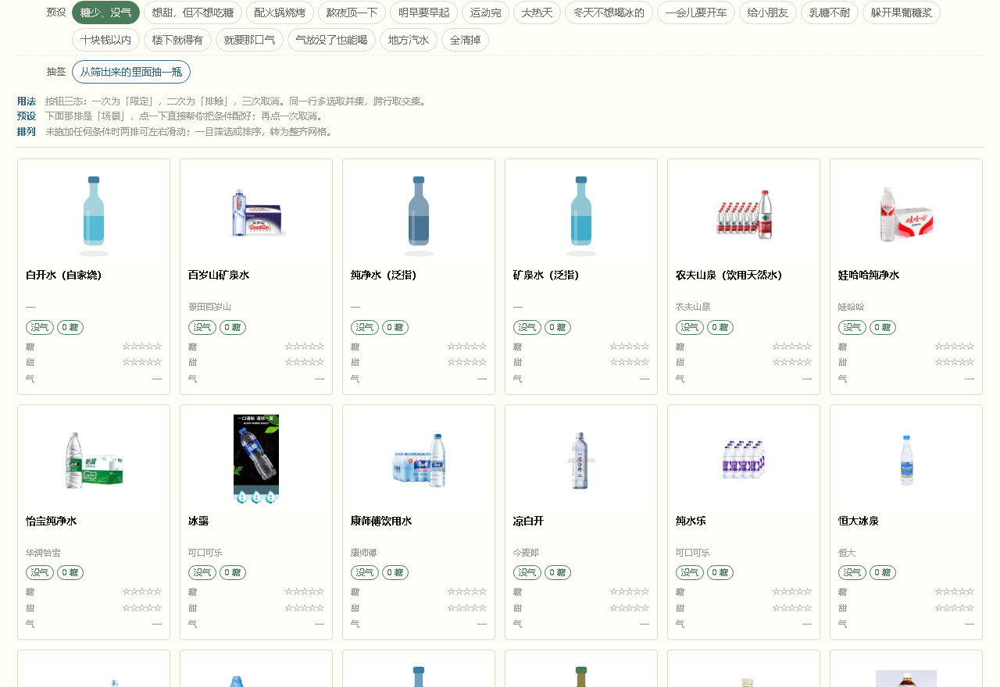
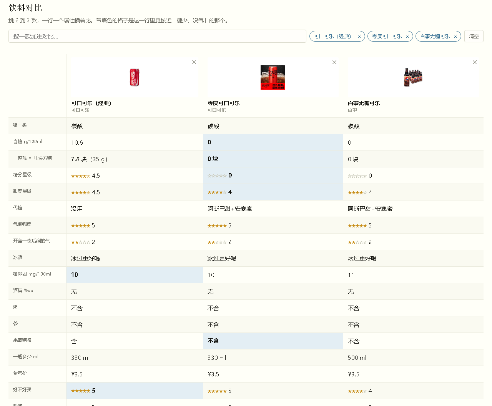

# 饮库 DrinkDB

**200+ 款饮料，总有一瓶是你想喝的。**

糖和甜是两件事：零度可乐一点糖都没有，喝着却很甜；纯牛奶有糖，喝着几乎不甜。
碳酸也不只看有没有气——开盖放一夜之后还剩多少气，才是真正的体验。

这个库把每一瓶拆成 **糖分 · 甜度 · 气泡强度 · 放一夜后剩的气 · 咖啡因 · 酒精 · 价格**，
分开记清楚，再按你在意的那几项去挑。

### 👉 **[bluedream666.github.io/drinkDB](https://bluedream666.github.io/drinkDB/)**

不用注册，没有广告，手机上直接打开就能用。

---

## 能做什么

**按场景挑，而不是按参数挑**

属性筛选是工程师的思路，「配火锅」「熬夜顶一下」「明早要早起」才是你真正的问法。
站里有 17 个场景预设，点一下就把条件配好了：

| 场景 | 它帮你配的条件 |
|---|---|
| 糖少、没气 | 含糖 ≤2.5g 且不含碳酸 |
| 想甜，但不想吃糖 | 甜度 ≥3 星、含糖几乎为 0 |
| 配火锅烧烤 | 无糖 + 酸感高，解腻那一口 |
| 熬夜顶一下 | 有咖啡因、糖别太多 |
| 明早要早起 | 不含咖啡因 |
| 一会儿要开车 | 一滴酒精都不含 |
| 给小朋友 | 无咖啡因、无酒精、糖也不多 |
| 乳糖不耐 / 躲开果葡糖浆 | 按奶和糖浆成分排 |
| 大热天 / 冬天不想喝冰的 | 按「冰过更好喝 / 冰不冰都行」分 |
| 十块钱以内 / 楼下就得有 | 按价格和常见度 |
| 地方汽水 | 有明确产地的小众品牌 |

还有：运动完、**就要那口气**（气泡强且耐放）、**气放没了也能喝**（开盖一夜就瘪）。

**横向对比**

挑 2–3 款并排比，一行一个属性，自动标出这一行里更接近「糖少、没气」的那个。
站在便利店货架前纠结的时候很好用。

**一瓶等于几块方糖**

「含糖 10.6g/100ml」没什么感觉，「**一瓶 12 块方糖**」才有。
按一块方糖 4.5g 折算，算的是整瓶，不是每 100ml。

**中国汽水地图**

北冰洋、冰峰、大窑、亚洲沙示、汉口二厂、崂山白花蛇舌草水……
按产地归拢，看看别处的人在喝什么。

**随机抽签**

懒得挑了？从你筛选出来的结果里随便抽一瓶，摇一摇，抽到哪瓶是哪瓶。

**导出 Excel**

一键导出全部 200+ 款、28 列完整属性，Excel / WPS 直接打开，离线也能用。
也可以只导出当前筛选的结果。

---

## 几个别处查不到的东西

| 条件 | 意思 |
|---|---|
| **甜，但没糖** | 甜度 ≥3 星却几乎不含糖。代糖党的核心需求 |
| **有糖，却不甜** | 含糖 ≥6g 但甜度 ≤2.5 星。牛奶、酸奶这种乳糖型的 |
| **放一夜还有气** | 开盖静置 24 小时后剩余气泡 ≥2 星 |
| **放一夜就没气** | 同上，剩余 ≤1 星 |
| **代糖不挂舌** | 没用代糖，或者用了但后味 ≤1.5 星 |

**「放一夜之后还剩多少气」是这个库独有的指标。**
常见的评测只说「气泡感强不强」，但一罐气再足的汽水，喝到一半放桌上，半小时后就是另一回事了。

筛选按钮是**三态**的：点一下 = 要（蓝色），点两下 = 不要（红色），点三下 = 取消。
比如「茶」点两下变红，就是「我不要带茶的」。

---

## 关于数据

糖分、热量、价格为常见规格的参考值。同一款换口味、换批次、换地区都可能不同，
**请以你手上包装的营养成分表为准**。

本站只是信息整理，不构成健康或营养建议。

有 153 款配了真实产品图（来自各品牌官方旗舰店的商品图，已压缩到长边 360px），
其余是「泛指 / 自制 / 玩梗」条目——比如「矿泉水（泛指）」「白开水（自家烧）」——
这些本来就没有对应商品，用的是自动生成的矢量图。

---

## 想补充一款？

网站右上角有 **「＋ 补一款」**，填完提交，我审核过就收录，也会进入导出文件。

发现数据错了、或者有想加的功能，欢迎在站上 **「创新区 → 说点什么」** 留言，
也可以直接在这里提 [Issue](https://github.com/BlueDream666/drinkDB/issues)。

---

## 关于这个库

起因是在 B 站一条视频的评论区里问了句「有没有糖少又不带气的饮料」，
收到了两百多条回复。答案很散，但里面有些东西是别处查不到的，
于是就一份份整理成了现在这个样子。

一个人做的，难免有错，也肯定还有漏掉的饮料。慢慢补。

**如果它对你有点用，点个 ⭐ Star 吧** —— 也方便你以后想查的时候找回来。

